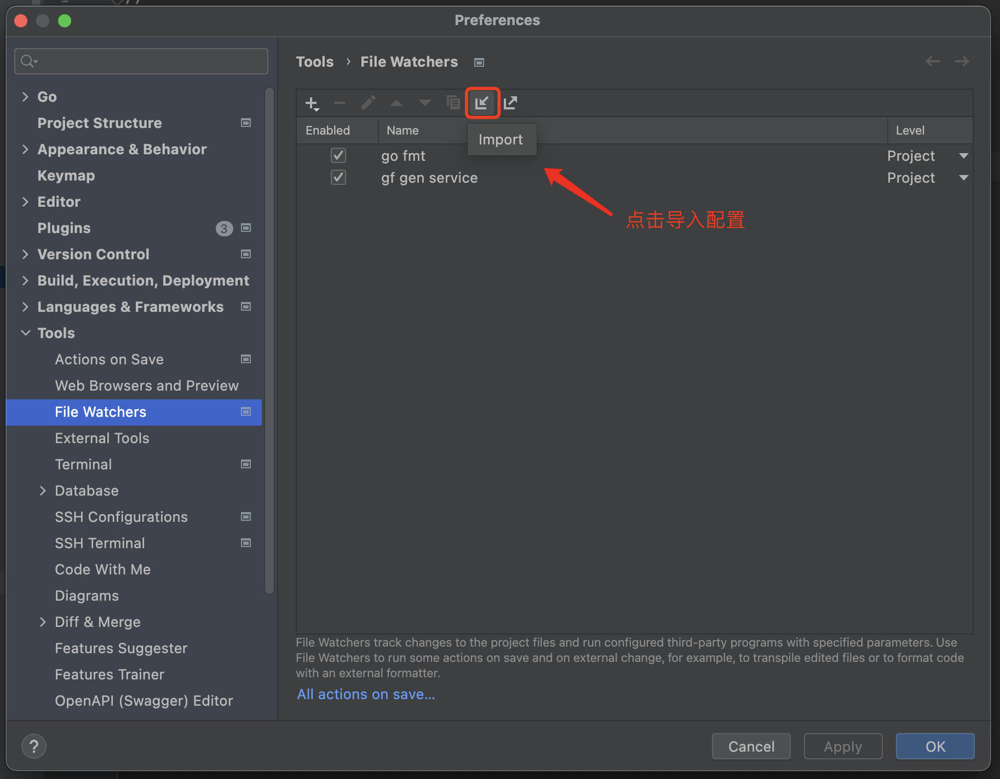

# goframe2-api-skeleton

这是一个基于 **GoFrame 2.0** 框架开发的 Web 应用程序骨架。它提供了一个基础框架，您可以在此基础上快速开发自己的 Web 应用程序。骨架中使用了 GoFrame 2.0 的模块化设计，将不同的功能分离到各自的目录和文件中，以实现更好的代码组织和可维护性。

---

## 安装说明

### 环境要求
- 确保已安装 **Go 1.15+** 版本。
- 确保已安装 Git。

### 安装步骤

1. **克隆仓库到本地**：
   ```bash
   git clone https://github.com/ReedTang/goframe2-skeleton.git
   cd goframe2-skeleton
   ```

2. 安装依赖：

```
go mod tidy
```

3. 配置代码自动生成：

如果您是使用的GolandIDE，那么可以使用我们提供的配置文件：watchers.xml  自动监听代码文件修改时自动生成接口文件。使用方式，如下图：


4. 修改配置文件

在 `manifest/config` 目录下，您可以找到 `config-example.yaml` 文件。 `config-example.yaml` 文件包含一个示例配置，其中包括应用程序的模式、端口、数据库、Redis 和日志等设置。我们需要将 `config-example.yaml` 文件重命名为 `config.yaml` 并根据我们的实际情况修改其中的配置项。
在 `hack/config` 目录下，您可以找到 `config-example.yaml` 文件。 `config-example.yaml` 文件包含一个示例配置，其中包括应用程序的模式、端口、数据库、Redis 和日志等设置。我们需要将 `config-example.yaml` 文件重命名为 `config.yaml` 并根据我们的实际情况修改其中的配置项。

5. 运行

```
go run main.go
```

## 代码结构

```
├── app
│   ├── controller   // 控制器（Controller）目录
│   │   ├── api      // Restful 风格 API 控制器
│   │   └── ...
│   ├── model  // 数据库模型
│   ├── router // 路由目录
│   ├── service // 服务层
│   ├── task    // 定时任务
│   └── view    // 模板文件（示例）
│       ├── admin   // 后台管理页面
│       ├── common  // 公共的页面元素
│       ├── index   // 首页
│       └── ...
├── boot    // 框架启动和初始化代码
├── config  // 配置文件
├── library // 公共函数库
├── public  // 静态文件（CSS、JS、图片等）
└── vendor  // 依赖库（已生成）
```

## 功能说明

1. 访问应用程序

在默认的情况下,应用程序会在 http://127.0.0.1:8000 上运行，您可以通过浏览器访问 http://127.0.0.1:8000/swagger-ui 查看 Swagger 文档。

## 问题反馈

如果您在使用本应用时遇到任何问题或错误，请在 [GitHub Issues](https://github.com/ReedTang/goframe2-skeleton/issues) 页面提交反馈。
